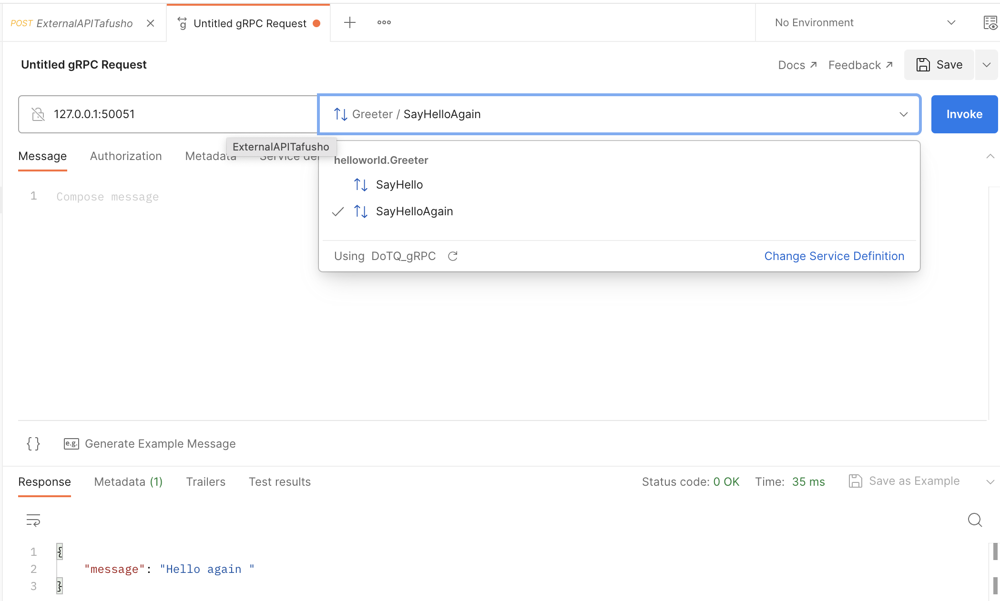

# grpc-sayhello-demo 🐳


[](https://github.com/tquangdo/grpc-sayhello-demo/issues/new)

## reference
- [official](https://grpc.io/docs/languages/java/quickstart/)
- [explain VNese](https://co-well.vn/nhat-ky-cong-nghe/gioi-thieu-ve-grpc-cuc-huu-ich-cho-dev/)

## src code
1. ### proto
    - `src/main/proto/helloworld.proto`
	```java
	service Greeter {
		// Sends a greeting
		rpc SayHello (HelloRequest) returns (HelloReply) {}
		// Sends another greeting
		rpc SayHelloAgain (HelloRequest) returns (HelloReply) {}
	}
	...
	service ServerReflection {
		rpc ServerReflectionInfo (stream ServerReflectionRequest) returns (stream ServerReflectionResponse) {}
	}
	```
1. ### server
    - `src/main/java/io/grpc/examples/helloworld/HelloWorldServer.java`
	```java
	@Override
  	public void sayHelloAgain(HelloRequest req, StreamObserver<HelloReply> responseObserver) {...}
	```
1. ### client
    - `src/main/java/io/grpc/examples/helloworld/HelloWorldClient.java`
	```java
	try {
		response = blockingStub.sayHelloAgain(request);
	} catch (StatusRuntimeException e) {...}
	```

## local deploy
1. ### server
    ```shell
    ./gradlew installDist
	./build/install/examples/bin/hello-world-server
	# INFO: Server started, listening on 50051
    ```
1. ### client
    ```shell
    ./build/install/examples/bin/hello-world-client
	# Feb 12, 2023 11:00:54 AM io.grpc.examples.helloworld.HelloWorldClient greet
	# INFO: Will try to greet world ...
	# Feb 12, 2023 11:00:54 AM io.grpc.examples.helloworld.HelloWorldClient greet
	# INFO: Greeting sayHello: Hello world
	# Feb 12, 2023 11:00:54 AM io.grpc.examples.helloworld.HelloWorldClient greet
	# INFO: Greeting sayHelloAgain: Hello again world
    ```
1. ### postman
	- new > `gRPC Request`
	- input `127.0.0.1:50051` & choose `src/main/proto/helloworld.proto`
    

## troubleshooting
1. ### ERR1
    ```shell
	grpcurl -d '{ "name": "World" }' localhost:50051 helloworld.Greeter/SayHello
	# Failed to dial target host "localhost:50051": tls: first record does not look like a TLS handshake
	```
1. ### ERR2
    ```shell
	grpcurl --plaintext localhost:50051 helloworld.Greeter/SayHello
	# Error invoking method "helloworld.Greeter/SayHello": failed to query for service descriptor "helloworld.Greeter": server does not support the reflection API
	```